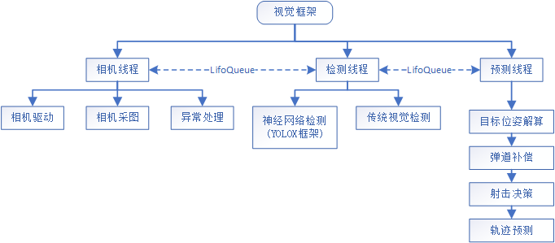
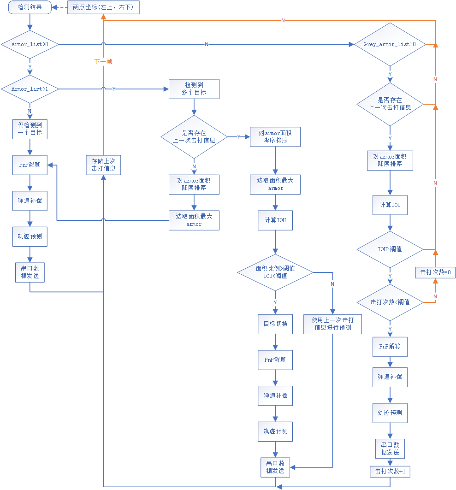

# 2022赛季Future战队视觉部署手册

## 1.环境安装
- 以下部署过程在Ubuntu 20.04下部署成功（18.04也可以），请自学Linux系统使用，NVIDIA
Jetson NX教程请参照nx_install_guide文件。
- 自学python虚拟环境或者anaconda、miniconda虚拟环境的使用，不建议使用系统自带python环境进行部署。
- 自学onnx，pth，trt，engine几种模型文件的区别。
- 首先请查阅网上教程完成以下模块的安装：<br>
CUDA, TensorRT<br>
pytorch, torchvision（注意两者的版本对应关系）
- 由于使用的检测框架是基于YOLOX，请根据YOLOX官方Doc完成相应第三方库的安装，
地址：(https://yolox.readthedocs.io/en/latest/train_custom_data.html)
- 根据此目录下的requirements.txt完成项目所需第三方库的安装，和YOLOX官方的库
有重合部分，按需安装即可。
- 若需要使用相机采集图像进行目标检测，需要安装大恒相机官方驱动，地址:(https://www.daheng-imaging.com/index.php?m=content&c=index&a=lists&catid=59&czxt=&sylx=21&syxj=#mmd)

## 2.文件说明
参照此目录下的filetree.txt查看各个模块文件说明。

## 3.使用说明
a.由于TensorRT生成的模型文件是根据不同的GPU设备优化的，配置好环境后
进入此目录使用```python3 rmcv_main.py```运行TRT会报错，有两种解决办法：<br>
(1)参照YOLOX官方教程将原始的模型文件```yolox_tiny_300.onnx```导出为trt模型
文件以后，替换```detector/detectorModule.py:Line:191```更换```trt_engine_file```
文件的路径为上一步生成的trt文件。

(2)仅使用onnx模型文件运行，这样推理速度比较慢，请自学onnxruntime模块的使用方法，
并且替换```rmcv_main.py```中的```detect_t```为自己编写onnx推理代码，onnx推理
过程参照```detecotr/ONNXRuntime/onnx_inference.py```文件。

b.如果仅需要使用视频测试，使用```rmcv_main.py:Line46```中的视频测试函数```video_test_main```作为相机线程
的启动函数即可；若需要使用相机测试，使用```collect_img_main```。

c.如果需要连接开发板串口进行调试，设置```common/Config.py:Line30 CVMSG2COM=True```
<br>如果需要实时显示测试结果，更改```common/Config.py:Line26 IMG_INFO=True```
<br>如果需要把检测图片生成视频，更改```common/Config.py:Line28 WRITE_VIDEO=True```
<br>目前各个线程之间使用后入先出队列通信，可在```common/msgQueue```中改为先入先出队列。

(3)检测框架流程图如下<br>



(4)预测模块中射击决策逻辑部分流程图如下<br>


